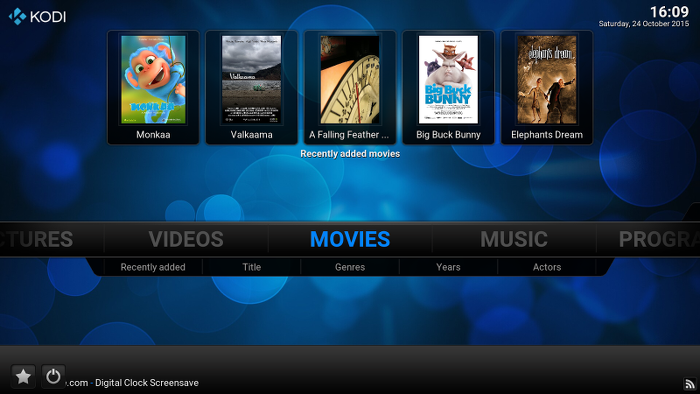
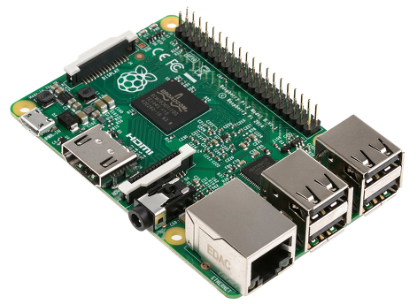
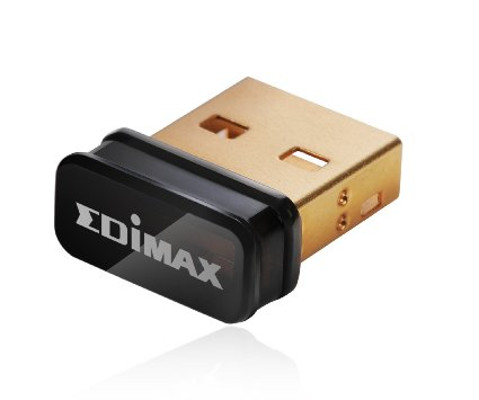
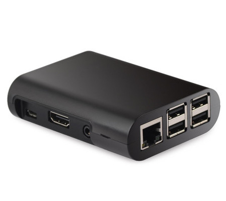
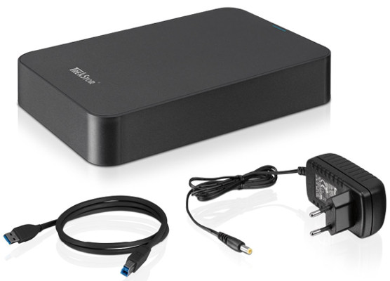
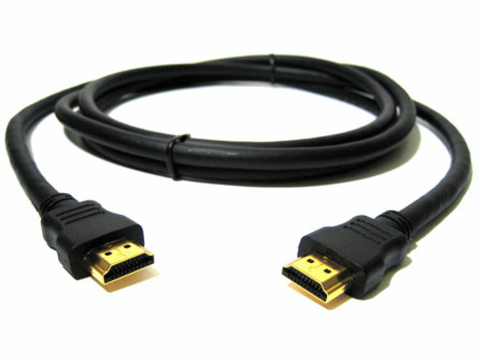
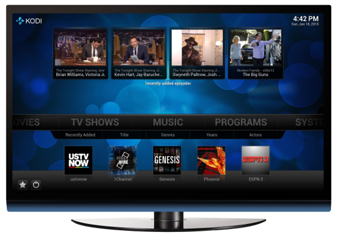
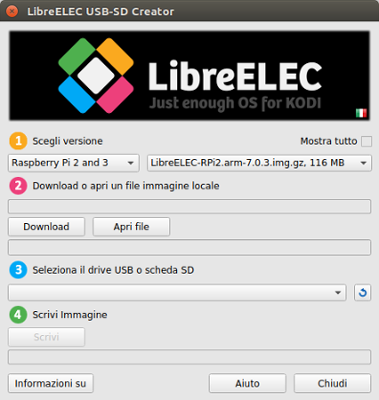

class: center, middle


---

class: middle, agenda, center

# Cos'è Kodi

---

class: center, agenda, middle

## Kodi



---

class: center, agenda, middle

## Sistemi operativi supportati

* Linux
* Windows
* MacOSX

---

class: center, agenda, middle

## Distribuzioni Linux per Raspberry con Kodi

* OpenELEC / Libreelec
* OSMC
* XBian

---

class: center, agenda, middle

## Versioni di Kodi e di OpenELEC

* v.14 - Helix - OpenELEC v5
* v.15 - Isengard - OpenELEC v6
* v.16 - Jarvis - Libreelec v7
* v.17 - Kripton (prossima versione)

---

class: middle

# Ingredienti

---

class: center, agenda, middle

## Raspberry PI 2/3



4 Porte USB, 1 Scheda di rete, 1 Porta HDMI

PI 2 mod.B - 1Gb RAM / PI 3 mod.B 1,2 GHz 64 bit Wi-Fi e Bluetooth
---

class: center, agenda, middle

## Scheda di memoria MicroSD (min. 8Gb)


Classe 10, 8/16Gb

---

class: center, agenda, middle

## Chiavetta Dongle Wi-Fi (facoltativo)




---

class: center, agenda, middle

## Case Raspberry PI




---

class: center, agenda, middle

## Alimentatore


5V. - 2A per PI 2, 3A per PI 3

---

class: center, agenda, middle

## Hard disk esterno alimentato




---

class: center, agenda, middle

## Cavo HDMI



---

class: center, agenda, middle

## Televisore con porta HDMI (cec)



---

class: center, agenda, middle

## Lista di materiale certificato UIELinux


```bash
https://goo.gl/RFZhnc
```

---

class: middle

# Installazione

---

class: center, agenda, middle

## Scaricare il programma

Collegarsi al sito di Libreelec

```bash
https://libreelec.tv/downloads/
```

Scaricare LibreELEC USB-SD Creator ed eseguirlo

---

class: center, agenda, middle

## Mettere Kodi nella MicroSD



Inserire la chiavetta, selezionare la versione, e cliccare Write Disk

---

class: middle

# Configurazione

---

class: center, agenda, middle

## Avviare LibreELEC

* Mettere l'SD nella RaspBERRY
* Collegare il cavo HDMI (tipo cec) fra la Rasperry e il Monitor
* Inserire il dongle WiFi nella Raspberry
* Collegare l'alimentazione alla Rasperry

---

class: center, agenda, middle

## Eseguire il setup iniziale

* Cambiare il nome del Media Center (facoltativo)
* Configurare la rete
* Attivare SSH e Samba

---

class: center, agenda, middle

## Impostare la lingua italiana

Percorso

```bash
System / Apparence / International
```

selezionare

```bash
Language / Italian (dopo qualche minuto si aggiorna la lista) (1)

Regione / Italia

Paese del fuso orario / Italia
```

(1) Nota: Per forzare l'aggiornamento della lista andare in Add-on / Installa da un repository / Kodi Add-on

---

class: center, agenda, middle

## Impostare la modalità avanzata

Percorso

```bash
Systema / Aspetto / Livello impostazioni
```

selezionare

```bash
Avanzato
```

---

class: center, agenda, middle

## Calibrare il video

Percorso

```bash
Sistema / Sistema / Uscita video / Calibrazione video
```

---

class: center, agenda, middle

## Impostare un server NTP

Percorso

```bash
Systema / sottomenu LibreELEC / Network
```

selezionare

```bash
Timeserver 1 sotto NTP Servers e impostare: pool.ntp.org
```

---

class: center, agenda, middle

# Film

---

class: center, agenda, middle

## Aggiungere la propria collezione di film

Percorso

```bash
MENU / Video / File / Scegliere il disco esterno / ...
```

Tasto destro su cartella Movies e

```bash
Imposta contenuto / (Film)
```

inoltre in Impostazioni scegliere

```bash
it
```

---

class: center, agenda, middle

# Musica

---

class: center, agenda, middle

## Aggiungere la propria collezione di musica

Percorso

```bash
MENU / Musica / File / Scegliere il disco esterno / ...
```

Tasto destro su cartella Music e

```bash
Scansiona elemento nella Libreria
```

---

class: center, agenda, middle

# Immagini

---

class: center, agenda, middle

## Aggiungere la propria collezione di foto

Percorso

```bash
MENU / Immagini / Scegliere il disco esterno / ...
```

Selezionare la cartella con le foto

```bash
Images
```

---

class: center, agenda, middle

# Add-on

---

class: center, agenda, middle

## Tipi di add-on

* Audio, Video, Weather
* Pictures, Screensaver, Skins
* Games, Programs, Lyrics
* Web interface, Metadata, Subtitle
* Services

---

class: center, agenda, middle

# Repository

---

class: center, agenda, middle

## Repository principali

* Kodi Add-on repository
* LibreELEC Add-on
* SuperRepo (da installare)
* Thoradia (da installare)

---

class: center, agenda, middle

## Installare SuperRepo

Aggiungere il sorgente

```bash
Gestore file / Aggiungi sorgente

http://srp.nu
```

Installare il repository

```bash
Sistema / Add-on / Installa da un file zip / SuperRepo / ...
jarvis / all / superrepo.kodi.isengard.all-x.y.zz.zip
```

---

class: center, agenda, middle

## Installare Thoradia (metodo per massaie)

Scaricare il file seguente e metterlo in una chiavetta USB

```bash
https://raw.githubusercontent.com/thoradia/thoradia/master/service.thoradia.zip

```

Inserire la chiavetta USB e nstallare il file (repository)

```bash
Sistema / Add-on / Installa da un file zip / Chiavetta USB / service.thoradia.zip
```

---

class: center, agenda, middle

## Installare Thoradia (metodo per nerd)

Collegarsi in ssh alla raspberry (la password è libreelec)

```bash
ssh 192.168.0.3 -l root
```

andare nella cartella storage e scaricare il thoradia
```bash
cd /storage
```

```bash
wget https://raw.githubusercontent.com/thoradia/thoradia/master/service.thoradia.zip
```

Installare il file

```bash
Sistema / Add-on / Installa da un file zip / Cartella Home / service.thoradia.zip
```

---

class: center, agenda, middle

## Altri Add-ons interessanti

Si installano col metodo nerd

```bash
https://github.com/streamondemand/plugin.video.streamondemand


```

---

class: center, agenda, middle

# Add-on Youtube e Vimeo

---

class: center, agenda, middle

## Installare Youtube e Vimeo

Andare in:

```bash
Sistema / Add-ons / Installa da repository / ...
Kodi Add-on repository / Add-on Video
```

Installare

```bash
Youtube e Vimeo
```

---

class: center, agenda, middle

# Add-on Meteo

---

class: center, agenda, middle

## Installare il Meteo

Percorso

```bash
Systema / Meteo / Servizio informazioni metereologiche /Altro
```

Scegliere

```bash
Yahoo
```

inoltre selezionare la località

---

class: center, agenda, middle

# Add-on IPTV

---

class: center, agenda, middle

## Installare un client IPTV

Percorso

```bash
Sistema / Add-on / Installa da un repository / ...
OpenELEC Add-ons (official) / Client PVR
```

installare il repository

```bash
PVR IPTV Simple Client
```

---

class: center, agenda, middle

## Configurare EPG 1/2

Installazione Rytec Downloader

```bash
Sistema / Add-on / Cerca / ...
rytec
```

Impostare una qualunque cartella di Download:

```bash
es: Home (/home/download)
```

Inserire il codice di attivazione

```bash
3025
```
---

class: center, agenda, middle

## Configurare EPG 2/2

Selezionare XMLTV e in XMLTV1 selezionare

```bash
Rytec Italy
```

Tornare in Setting e selezionare download manuale

---

class: center, agenda, middle

## Configurare i canali IPTV 1/2

Percorso

```bash
Sistema / Add-on / I miei add-ons / ...
PVR IPTV Simple Cliente
```

posizione locale

```bash
http://pastebin.com/raw/8GpCCkhf
```
---

class: center, agenda, middle

## Configurare i canali IPTV 2/2

Impostare l'EPG

In posizione locale scegliere

```bash
/home/download/rytec*
```

---

class: center, agenda, middle

## Attivare PVR

Percorso

```bash
Sistema / TV / Generale / Abilitato
```

al termine riavviare KODI

---

class: center, agenda, middle

# Add-on Torrent server

---

class: center, agenda, middle

## Installare Transmission

Percorso

```bash
Sistema / Add-on / Installa da un repository / ...
OpenELEC Add-ons (unofficial) / Servizi
```

selezionare

```bash
transmission
```

---

class: center, agenda, middle

## Accedere a Transmission via Web

Aprire il browser nella rete locale e digitare

```bash
http://xxx.xxx.xxx.xxx:9091/transmission/web/
```

dove xxx.xxx.xxx.xxx è l'indirizz ip di openelec

```bash
esempio: http://192.168.0.20:9091/transmission/web/
```
---

class: center, agenda, middle

## Accedere a Transmission con Android

Aprire il play store e scaricare l'app Transmission.
Configurare l'app con i dati di openelec

Importante

Per accedere a openelec dall'esterno della vostra rete
occorre configurare un dns dinamico (es: freedns)

---

class: center, agenda, middle

## Configurare Transmission

Attivare

```bash
Use Authentication
```

impostare utente e password e una cartella di download

---

class: center, agenda, middle

## Risorse

### https://kodi.tv
### http://kodi.stefanoteodorani.it
### http://openelec.tv/

---

class: center, agenda, middle


### www.stefanoteodorani.it

```
teopost@gmail.com
```
